===========
Memo Scilab
===========

Entrées / Sorties
=================

* Lire une donnée utilisateur : ``input`` ::

   x = input("Entrer un nombre : ")
   
* Afficher un résultat : ``disp`` ::

   disp(x, "La valeur de x est : ")          // affiche sur 2 lignes
   disp(3, 2, 1)                             // affiche 1. 2. 3. sur 3 lignes
   
   disp("La valeur de x est : " + string(x)) // affiche sur une seule ligne
   disp("C''est bon !")                      // double '' dans une string ""

* Afficher +/- de décimales pour les réels : ``format`` ::

   format(10)  // affichage par défaut = 10 caractères y compris signe et point décimal
   
Les calculs sont effectués avec 16 chiffres significatifs.
   
* Effacer une fenêtre ::

   clc         // clear console
   clf         // clear figure
   
* Edition ::

   1 + ..         // .. = instructions sur plusieurs lignes
   2              // 3.
   
   a = 1, b = 2   // , plusieurs instructions sur une même ligne. Affiche les 2 affectations.
   a = 1; b = 2   // ; plusieurs instructions sur une même ligne. N'affiche pas les affectations intermédiaires.

Nombres
=======

Réels par défaut. Tout est matrice. ::

   1     // 1.
   1.    // 1.
   1.0   // 1.
   1e0   // 1.
   [1]   // 1.

Constantes
----------

Précédées de ``%`` ::

   %pi            // 3.1415927
   %e             // 2.7182818
   %i             // %i ^ 2 = -1
   %T, %F         // true, false
   %t, %f         // idem

Fonctions
---------

::

   x + y, x - y
   x * y, x / y
   -x, abs(x)
   x^2, sqrt(x)
   log(x), exp(x)          // népérien
   sin(x), cos(x), tan(x)  // radian
   
   floor(x)                // partie entière, floor(-1.5) = -2
   int(x)                  // partie avant la virgule, int(-1.5) = -1
   factorial(n)            // n!
   
   hors programme :
   double(%F), bool2s(%F)  // 0. 
   double(%T), bool2s(%T)  // 1.

Variables
---------

Dernier résultat ::

   ans            // answer

Affectation ::

   a = 2          // affiche a automatiquement
   b = 3;         // n'affiche pas b

En dehors des **fonctions**, toute affectation est affichée, sauf si terminée par ``;``.

Suppression ::

   clear          // supprime toutes les variables / functions
   clear a        // supprime la variable a / la function a
   
Matrices
========

**Vecteurs** (matrices à 1 dimension) ::

   [x, y, z]   // vecteur ligne, ou [x y z] à ne pas utiliser (confusion)
   [x; y; z]   // vecteur colonne

Concaténation : x y z peuvent être eux-mêmes des vecteurs.

**Matrices** ::

   m = [a, b, c; d, e, f]  // ; séparateur de lignes
   
   Peut aussi s'écrire :
   m = [
   a, b, c
   d, e, f
   ]

   m(i, j)     // coefficient ligne i, colonne j
   m($, $)     // coefficient dernière ligne, dernière colonne
   m(i, :)     // ligne i (: = 1:$)
   m(:, j)     // colonne j
   m($, :)     // dernière ligne
   m(:, $)     // dernière colonne

   zeros(1, 3)    // [0, 0, 0]
   zeros(m)       // m (définie) est remplie de 0
   
   ones(1, 3)     // [1, 1, 1]
   ones(m)        // m (définie) est remplie de 1

   eye(2, 2)      // [1, 0; 0, 1]
   eye(m)         // m (définie) est la matrice identité

   diag([])       // matrice diagonale avec les termes spécifiés en paramètres
   
Concaténation : a b c d e f peuvent être eux-mêmes des matrices. ::

   C = [A, B]     // concaténation en ligne (nouvelles colonnes)
   D = [A; B]     // concaténation en colonne (nouvelles lignes)

   v = [1, 2]     // [1, 2]
   v = [v, 3]     // [1, 2, 3] (syntaxe la plus simple)
   v(4) = 4       // [1, 2, 3, 4]
   v($+1) = [5]   // [1, 2, 3, 4, 5]
   v = [v, 6:9]   // [1, 2, 3, 4, 5, 6, 7, 8, 9]

   m = []            // []
   m(1) = 1          // [1]
   m(2) = 2          // [1; 2] en colonne !
   m = m'            // [1, 2] en ligne
   
   m(2, 1) = 3             // [1, 2; 3, 0] nouvelle ligne, remplie par 0 pour les trous
   m(3, :) = 4             // [1, 2; 3, 0; 4, 4] nouvelle ligne remplie avec des 4
   m(:, 3) = [5; 6; 7]     // [1, 2, 5; 3, 0, 6; 4, 4, 7] nouvelle colonne [5; 6; 7]
   m($+1, :) = [7, 8, 9]   // nouvelle ligne [7, 8, 9]
   
   m = [m; [7, 8, 9]]      // nouvelle ligne   (syntaxe la plus simple)
   m = [m, [5; 6; 7; 8; 9] // nouvelle colonne (syntaxe la plus simple)

**Tableaux** (ce sont aussi des vecteurs lignes)

* Pour les boucles ``[start : step : end]`` ::

   [start : step : end] // [] facultatifs
   1 : 1 : 6            // de 1 à 6 par pas de 1 [1, 2, 3, 4, 5, 6]
   1 : 6                // idem, par défaut le pas = 1
   1 : 2 : 6            // [1, 3, 5] (par pas de 2)

* Pour les graphes ``linspace`` ::

   linspace(1, 6, 6)    // 6 valeurs équiréparties de 1 à 6 [1, 2, 3, 4, 5, 6]
   linspace(1, 2, 3)    // 3 valeurs équiréparties de 1 à 2 [1, 1.5, 2]

**Fonctions** ::

   length(m)      // longueur de m, nombre de termes
   size(m)        // dimensions, sous la forme [nl, nc] = nb lignes, nb colonnes
   size(m, "r")   // nb lignes, idem size(m, 1) ou s = size(m); s(1)
   size(m, "c")   // nb colonnes, idem size(m, 2) ou s = size(m); s(2)
   
   sum(m)         // somme des termes
   sum(m, "r")    // ligne des sommes des colonnes
   sum(m, "c")    // colonne des sommes des lignes
   cumsum(m)      // somme cumulative des termes
   cumsum(m, "r") // somme cumulative par lignes
   cumsum(m, "c") // somme cumulative par colonnes
   prod(m)        // produit des termes
   
   min(m)         // min des termes
   min(m, "r")    // ligne des min des colonnes ("c" colonne des min des lignes)
   max(m)         // max des termes
   max(m, "r")    // ligne des max des colonnes ("c" colonne des max des lignes)
   mean(m)        // moyenne des termes
   median(m)      // medianne des termes triés : partage l'effectif total en 2 effectifs de populations égales
   
   1 / m          // inverse
   1 ./ m         // inverse termes à termes
   m * m          // produit de m x m
   .*             // * termes à termes
   m^2            // m x m (matrice carrée !)
   .^             // ^ termes à termes
   
   m'             // transposée de m
   
   rank(m)        // rang de m
   det(m)         // déterminant de m
   inv(m)         // inverse de m si m matrice carrée inversible
   trace(m)       // trace de m
   triu(m)        // matrice triangulaire supérieure
   spec(m)        // spectre de m (matrice carrée), ensemble des valeurs propres

Exemples (vecteurs) ::

   v = [1:3]      // [1, 2, 3] ou v = 1:3
   v(1)           // 1 les indices commencent à 1
   v(2)           // 2
   v($)           // 3
   v(1, 3)        // 3 (ligne 1, indice 3)
   v([1, 3])      // [1, 3]
   v(2:3)         // [2, 3] ou v([2:3])
   v(1:$)         // [1, 2, 3]
   v(:)           // [1; 2; 3] en colonnes ! cf m(:)
   length(v)      // 3
   size(v)        // [1, 3] 1 ligne x 3 colonnes
   sum(v)         // 6
   cumsum(v)      // [1, 3, 6]
   prod(v)        // 6
   mean(v)        // 2
   1 / v          // [0.07; 0.14; 0.21] inverse de v
   1 ./ v         // [1, 0.5, 0.33] inverse termes à termes
   
   v'             // [1; 2; 3]
   
Exemples (matrices) ::

   m = [1:3; 4:6] // [1, 2, 3; 4, 5, 6]
   length(m)      // 6
   size(m)        // [2, 3] 2 lignes x 3 colonnes
   size(m, "r")   // 2 (lignes), idem size(m, 1)
   size(m, "c")   // 3 (colonnes), idem size(m, 2)
   sum(m)         // 21
   sum(m, "r")    // [5, 7, 9] résultat en ligne des sommes des colonnes (dim 1)
   sum(m, "c")    // [6; 15] résultat en colonne des sommes des lignes (dim 2)
   cumsum(m)      // [1, 7, 15; 5, 12, 21], dans l'ordre colonnes par colonnes
   cumsum(m, "r") // [1, 2, 3; 5, 7, 9], sommes par lignes
   cumsum(m, "c") // [1, 3, 6; 4, 9, 15], sommes par colonnes
   min(m)         // 1
   max(m)         // 6
   mean(m)        // 3.5
   median(m)      // 3.5 = moyenne des termes 3 et 4 (cf m(:) triée) car ne tombe pas sur un terme de la matrice
   
   m(1, 2)        // (l1, c2) = 2
   m(2, 1)        // (l2, c1) = 4
   m(1, :)        // ligne 1 = [1, 2, 3]
   m(:, 1)        // colonne 1 = [1; 4]
   m(2, 1:2)      // [4, 5]
   m(2, [1, 3])   // [4, 6]
   m(2, 2:-1:1)   // [5, 4]  ordre inverse
   m(:)           // m(1:$) = [1; 4; 2; 5; 3; 6] énumération colonnes par colonnes
   m(1:2)         // [1; 4] indices 1:2 de m(:)
   m(2)           // 4      indice 2 de m(:)
   m([1, 3])      // [1; 2] indices de m(:)
   
   2 * m          // [2, 4, 6; 8, 10, 12]
   1 + m          // [2, 3, 4; 5, 6, 7]
   ones(2,3) + m  // [2, 3, 4; 5, 6, 7]

**Somme, moyenne, médiane** ::

   v = [1, 2, 96]
   sum(v)         // 99
   mean(v)        // 33
   median(v)      // 2 = le 2e terme de v trié

   v = [1, 2, 4, 93]
   sum(v)         // 100
   mean(v)        // 25
   median(v)      // 3 = moyenne 2,4 des 2e et 3e termes de v trié

**Filtre** : ``find`` (retourne des indices) ::

   find(cond m)      // indices de m qui vérifient la condition
   find(m)           // = find(m <> 0)
   find(m, max)      // max indices retournés au plus

   v = [3, 2, 4, 1, 4]
   find(v > 2)       // [1, 3, 5] indices !
   v(find(v > 2))    // [3, 4, 4] valeurs
   
   find(v == max(v)) // [3, 5]
   
   find(v > 2) <> []       // T : il y a des termes > 2 dans v
   length(find(v > 4)) > 0 // F : il n'y a pas de terme > 4 dans v
   
   m = [1, 2, 3; 4, 5, 6]
   find(m > 3)       // [2, 4, 6] indices de m(:) = [1; 4; 2; 5; 3; 6]
   m(find(m > 3))    // [4; 5; 6] car m(:) vecteur colonne
   
**Tri** : ``gsort`` ::

   gsort(m)          // valeurs de m triés dans l'ordre décroissant (dans une matrice de même taille)
   unique(m)         // valeurs uniques de m (pas de doublon) dans l'ordre croissant
   
   v = [3, 2, 4, 1, 4]
   gsort(v)             // [4, 4, 3, 2, 1]
   gsort(v, "g", "i")   // [1, 2, 3, 4, 4]
   unique(v)            // [1, 2, 3, 4]
   
   m = [1, 2, 3; 4, 5, 6]
   gsort(m)             // [6, 4, 2; 5, 3, 1] !!
   gsort(m, "g", "i")   // [1, 3, 5; 2, 4, 6] !!
   unique(m)            // [1; 2; 3; 4; 5; 6] vecteur colonne

Logique
=======

**Opérateurs** ::

   ==
   <>
   >, >=
   <, <=

**Tests** ::

   &        // et
   |        // ou
   ~        // négation (hors programme)

Exemples ::

   a = 1
   (a == 1) & (a <> 1)  // F (parenthèses facultatives)
   a == 1 | a <> 1      // T
   ~(a == 1)            // F

   // Tester si n est pair
   if n == 2 * floor(n / 2)
   
   // Tester si n est divisible par p
   if n == p * floor(n / p)

**Conditions** ::

   if condition then
      // ...
   end

   if condition then
      // ...
   else
      // ...
   end

   if condition then
      // ...
   elseif
      // ...
   else
      // ...
   end

Boucles
=======

**for** ::

   for i = 1 : 10  // itération par pas de 1
      // ...
   end
   disp(i)        // i = 10 à la sortie de la boucle

Exemples ::

   v = zeros(1, 3);
   for i = 1:3
      v(i) = 2*i;
   end            // v = [2, 4, 6]   
   
   v = []
   for i = 1:3
      v(1, $+1) = 2*i;
   end            // v = [2, 4, 6]

**while** ::

   i = 0;
   while i <= 10  // condition
      i = i + 1;
      // ...
   end
   disp(i)        // i = 10 à la sortie
   
Fonctions
=========

::

   function r = f(a, b) // 2 arguments a, b
      r = ...
   endfunction
   
   result = f(1, 2)

   function [y1, y2] = f(x1, x2) // 2 arguments xi et 2 valeurs retournées yi
      y1 = ...
      y2 = ...
   endfunction
   
Exemples ::

   function y = fact(x)
      if x <= 0 then
         y = 1
      else
         y = x * fact(x - 1)
      end
   endfunction

   function y = fact(x)
      r = 1
      for i = x : -1 : 1
         r = r * i
      end
      y = r
   endfunction

**feval** ::

   [z] = feval(x, f)       // appels de f pour tous les xi, résultat dans [z]
   [z] = feval(x, y, f)    // f avec 2 arguments
   
Exemple ::

   function y = f(x)
      y = 1 / x
   endfunction
   
   f(2)              // 0.5
   f([1, 2])         // [0.2; 0.4]
   feval([1, 2], f)  // [1, 0.5]
   
Proba
=====

**rand** ::

   rand()               // valeur aléatoire dans [0, 1[
   rand(l, c)           // matrice l lignes x c colonnes de valeurs aléatoires dans [0, 1[
   
   rand(l, c, "normal") // ou "nor" selon loi normale centrée réduite (0,1), "uniform" ou "unf" par défaut

**grand** ::
   
   grand(l, c, "bin", N, p)         // loi binomiale paramètres N, p
   grand(l, c, "poi", lambda)       // loi de poisson, paramètre λ
   grand(l, c, "nor", mu, sigma)    // loi normale, paramètre μ, σ (écart-type)
   grand(l, c, "unf", a, b)         // loi uniforme à densité sur [a, b[
   grand(l, c, "uin", a, b)         // loi uniforme discrète sur [a, b] (b compris)
   grand(l, c, "exp", e)            // loi exponentielle, paramètre e = 1/λ
   grand(l, c, "geom", p)           // loi géométrique, paramètre p
   
   grand(l, c, "gam", shape, scale) // loi gamma, paramètre 
   grand(l, c, "markov", p, x0)     // loi Markov, paramètre 

Exemples ::

   floor(10 * rand())               // entier aléatoire entre 0 et  9 (10 valeurs)
   
   1 + floor(10 * rand())           // entier aléatoire entre 1 et 10 (10 valeurs)
   floor(grand(l, 1, "unf", 1, 11)) // idem
   grand(l, 1, "uin", 1, 10))       // idem

   r = rand(1, 1000);               // vecteur de 1000 valeurs aléatoires dans [0, 1[
   length(find(r < 0.5))            // nb de valeurs < 0.5

Lancer d'un dé à 6 faces ::

   1 + floor(6 * rand())
   // ou
   grand(l, 1, "uin", 1, 6))

Succes = T avec la probabilité p = 0.7 ::

   succes = rand() < p              // T pour 70%, F pour 30%

   tirages = rand(1, 10);           // 10 tirages
   succes = tirages < p             // [F, T, F, T, T, T, T, T, T, F]
   nb_succes = length(find(succes)) // 7
   
Succes = 1 avec la probabilité p = 0.7 ::

   succes = floor(p + rand())       // 1 pour 70%, 0 pour 30%
   // ou
   succes = double(rand() < p)      // 1 pour 70%, 0 pour 30%
   
   tirages = rand(1, 10);           // 10 tirages
   succes = zeros(1, 10);
   for i = find(tirages < p)        // [2, 4, 5, 6, 7, 8, 9] par exemple
      succes(i) = 1;                // [0, 1, 0, 1, 1, 1, 1, 1, 1, 0]
   end
   // ou
   tirages = rand(1, 10);
   succes = double(tirages < p)     // [0, 1, 0, 1, 1, 1, 1, 1, 1, 0]

Statistiques
------------

**tabul** ::

   tabul(X)       // [c1; c2] matrice 2 colonnes
                  //    avec c1 = colonne des valeurs uniques de X dans l'ordre décroissant
                  //    et   c2 = colonne du nombre d'occurences de chaque valeur
   
   tabul(X, "i")  // idem mais c1 triée dans l'ordre croissant

**dsearch** ::

   dsearch(X, bins)        // localise les termes de X dans chacune des classes bins continues
                           // bins = [a, b, c], ici 2 classes [a,b] et ]b,c] 
                           // a < b < c, intervalles ouverts à gauche, sauf pour la 1ère classe
   
   dsearch(X, bins, "d")   // bins discrètes, sinon "c" continu par défaut
                           // bins = [a, b, c], ici 3 classes discrètes a, b, c
                           // a < b < c

   >> retourne [i_bin [,counts [,outside]] :
      i_bin               : indices de classe pour chaque terme de X
      counts  (optionnel) : occurences dans chaque classe
      outside (optionnel) : occurences en dehors de toute classe
   
Exemples ::

   x = floor([0:0.2:2] .^ 2)     // [0, 0, 0, 0, 0, 1, 1, 1, 2, 3, 4]
   
   tabul(x)                      // [[4; 3; 2; 1; 0], [1; 1; 1; 3; 5]]
   tabul(x, "i")                 // [[0; 1; 2; 3; 4], [5; 3; 1; 1; 1]]

   x                             // [0, 0, 0, 0, 0, 1, 1, 1, 2, 3, 4]
   dsearch(x, [0, 2, 4])         // [1, 1, 1, 1, 1, 1, 1, 1, 1, 2, 2]
   // 2 bins = [0,2], ]2,4]      // counts = [9, 2], outside = 0                      
                              
   dsearch(x, [0, 2, 4], "d")    // [1, 1, 1, 1, 1, 0, 0, 0, 2, 0, 3]
   // 3 bins = [0, 2, 4]         // counts = [5, 1, 1], outside = 4
                              
   x = floor(10 * rand(1, 10))   // [9, 0, 4, 2, 4, 2, 1, 7, 2, 1]
   dsearch(x, [0:9], "d")        //[10, 1, 5, 3, 5, 3, 2, 8, 3, 2]
   dsearch(x, [-1:9])            //[10, 1, 5, 3, 5, 3, 2, 8, 3, 2]
   // 10 bins = [-1,0], ]0,1], . // counts = [1, 2, 3, 0, 2, 0, 0, 1, 0, 1]

   tabul(x, "i")                 // [[0; 1; 2; 4; 7; 9], [1; 2; 3; 2; 1; 1]]

Indicateurs de position
'''''''''''''''''''''''

**Mode** :
   La (les) valeurs ou classes dont l'effectif est le plus élevé.
   
   ::
   
      x = [0, 0, 0, 2, 2, 1, 1, 1, 3]
      [d, occ] = dsearch(x, [0:3], "d")
      modes = find(occ == max(occ))    // [1, 2] = indices des classes
      
      t = tabul(x)
      v = t(:,1)
      occ = t(:,2)
      imax = find(occ == max(occ))     // [3, 4]
      v(imax)                          // [1, 0] = valeurs des classes
   
**Moyenne** :
   mean()

**Médiane** :
   median()

**Quantiles** :
   quart() : quartile, idem médiane mais en 4 parties égales
   
   ::

      v = [1, 2, 3, 4, 5, 6, 7, 8]
      median(v)      // 4.5
      quart(v)       // [2.5; 4.5; 6.5]

Indicateurs de dispersion
'''''''''''''''''''''''''

**Etendue** :
   max() - min()

**Ecart inter-quantiles** :
   .
   
**Variance**, **écart-type** :
   var()         // ~ variance
   
   stdev()       // ~ écart-type

Graphiques
==========

plot
----

::

   plot(x, y)        // point(x,y)
   plot(X, Y)        // segments X = [xa,xb,xc...], Y = [ya,yb,yc...]
   
   plot(X, f(X))     // pour tracer f
   plot(X, f)        // idem

   plot(X, f, style) // le 3e paramètre précise le style des points

   // X vecteur colonne
   plot(X, [f(X), g(X)], style)

Exemples ::

   plot(1, 1)              // point(1,1) bleu invisible
   plot(1, 1, ".")         // point(1,1) bleu visible
   plot([0, 1], [0, 1])    // segment bleu [0,0] - [1,1]

   function y = f(x)
      y = x .^ 2  // ne pas utiliser x^2, confusion avec les vecteurs
   endfunction
   
   X = linspace(0, 2, 11);
   plot(X, f)
   plot(X, f(X))

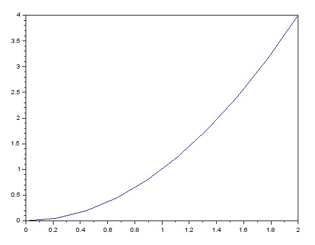

Styles, *string* ::

   Segments : "-" (par défaut) utilisable en plus des points
   Points   : ".", "+", "x", ".-" (points et segments), "-." (segments pointillés), ...
   
   Couleurs :
      "k"   // black
      "b"   // blue (par defaut)
      "g"   // green
      "c"   // cyan
      "r"   // red
      ...

   Exemples : ".", ".k", "k.", ".-r",

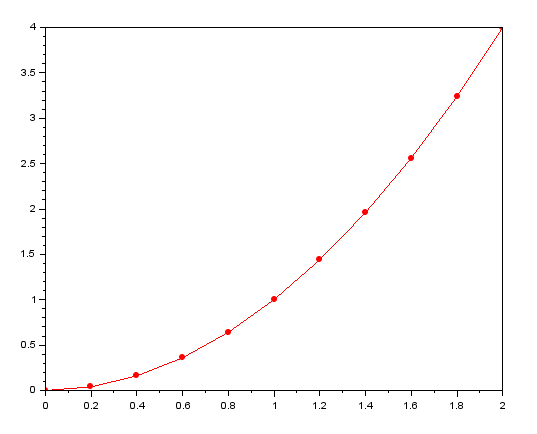

**Plusieurs graphes** :

On peut appeler plusieurs fois ``plot()`` successivement.

Pour des graphes construits simultanément, X doit être un vecteur **colonne** ::

   function y = g(x)
      y = x .^ 3
   endfunction

   // X doit être un vecteur colonne
   X = linspace(0, 2, 10)';  // noter le ' pour la transposée
   
   // mêmes abscisses X
   plot(X, [f(X), g(X)])       // les 2 courbes sont automatiquement de couleurs successives (bleue, vert ...)
   plot(X, [f(X), g(X)], ".-") // même paramètre de style pour les 2 courbes, couleurs successives

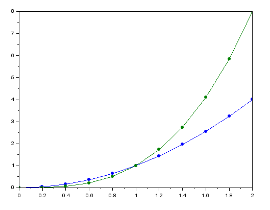

**Suites** ::
   
   n = 1 : 20;
   u = (-0.8) .^ n;
   
   Par défaut, 1er paramètre = indices du vecteur Y
   
   plot(n, u)     // n est facultatif ici car n = [1:20] = indices du vecteur u
   plot(u)        // segments
   plot(u, ".")   // points

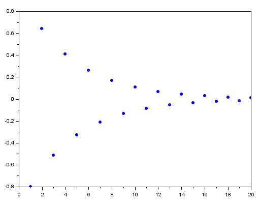

::

   // Attention
   u = []
   for n = 1 : 20
      u(n) = (-0.8)^n;
   end
   // ici, n = 20, pas [1:20]
   plot(n, u)  // Erreur
   plot(u)     // Ok

Si la suite commence à l'indice 0, il faut le préciser :

::

   n = 0 : 20;
   u = (-0.8) .^ n;
   plot(n u, ".") // ok
   plot(u, ".")   // tous les points sont décalés : u0 est présenté en indice 1
   
plot2d
------

::

   plot2d(X, f(X))
   plot2d(X, f(X), style)
   
   // X vecteur colonne
   plot2d(X, [f(X), g(X)], [style f, style g])

Exemple ::

   function y = f(x)
      y = x .^ 2  // ne pas utiliser x^2, confusion avec les vecteurs
   endfunction
   
   X = linspace(0, 2, 11);
   plot2d(X, X .^ 2)
   plot2d(X, f(X))
   plot2d(X, f(X), style)
   plot2d(X, f(X), style=style)  // paramère nommé
   
Pour appeler successivement f sur les valeurs de X ::

   plot2d(X, feval(X, f))
   fplot2d(X, f)

Styles, *entier* ::

   Points, entiers négatifs :
      0  // .
     -1  // +
     -2  // x
     ...
   
   Couleurs, entiers positifs :
      1   // black (par défaut)
      2   // blue
      3   // green
      4   // cyan
      5   // red
      ...

   Compliqué de combiner points et couleurs. Il faut utiliser les handles gca(), gce(), ...

**Plusieurs graphes** :

On peut appeler plusieurs fois ``plot()`` successivement.

Pour des graphes construits simultanément, X doit être un vecteur **colonne** ::

   function y = g(x)
      y = x .^ 3
   endfunction

   // X doit être un vecteur colonne
   X = linspace(0, 2, 10)';  // noter le ' pour la transposée
   
   // mêmes abscisses X
   plot2d(X, [f(X), g(X)])          // les 2 courbes sont automatiquement de couleurs différentes (1, 2, ...)
   plot2d(X, [f(X), g(X)], [1, 2])  // 2 styles différents en paramètre

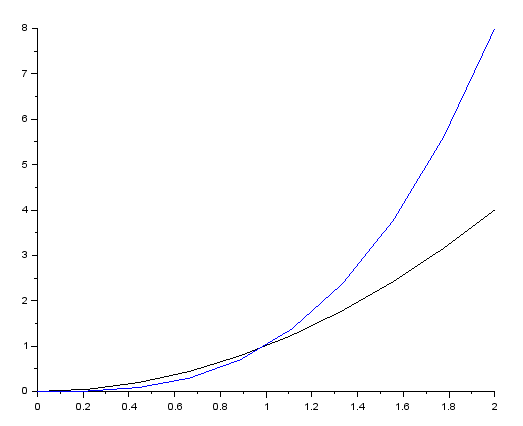

**plot2d2** :
   Les points sont reliés en *escalier* et non par des segments.

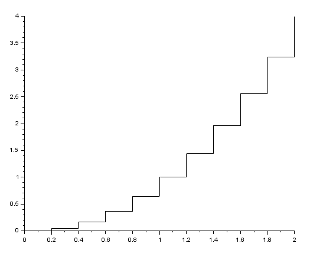

**plot2d3** :
   Les points sont remplacés par des *bâtons* (fins) verticaux.

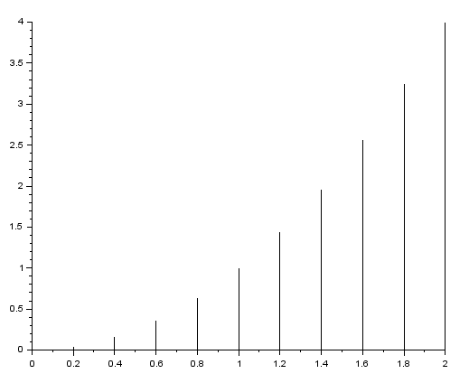

bar
---

Les points sont remplacés par des *barres* (larges) verticales centrées sur les abscisses.

Par défaut : couleur bleue, largeur 0.8

Exemples ::

   x = floor(10 * rand(1, 10))      // [9, 0, 4, 2, 4, 2, 1, 7, 2, 1]
   bar(x)      // barres bleues centrées sur les abscisses = 1:10

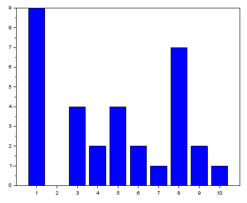

histplot
--------

Histogrammes

::

   histplot(n, X)    // histogramme en % de X sur n classes également réparties sur min(X) - max(X)
                     // les barres sont de la largeur des classes, hauteur = count / (min - max)
   
   histplot(bins, X) // histogramme en % de X sur les classes bins

Exemple ::

   x = floor(10 * rand(1, 10))   // [9, 0, 4, 2, 4, 2, 1, 7, 2, 1]
                                    
   histplot([-1:9], x)           // 10 classes de largeur 1 : [-1,0], ]0,1], ]1,2] .. ]8,9]
                                 // [0.1, 0.2, 0.3, 0, 0.2, 0, 0, 0.1, 0, 0.1]
   // idem
   dsearch(x, [-1:9])            // 10 classes [10, 1, 5, 3, 5, 3, 2, 8, 3, 2]
                                 // counts = [1, 2, 3, 0, 2, 0, 0, 1, 0, 1]

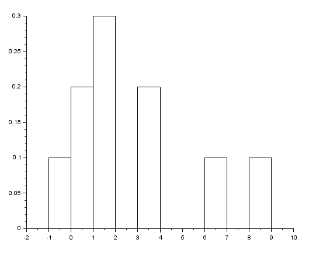

Erreurs :

* ``histplot(10, x)``, largeur automatique des classes = (max - min = 9) / 10, rapports / 9 ::

   x                             // [9, 0, 4, 2, 4, 2, 1, 7, 2, 1]
   histplot(10, x)               // 10 classes de largeur 9 / 10 = 0.9 [0,.9], ].9,1.8] ...
                                 // [1/9; 2/9; 3/9; 0; 2/9; 0; 0; 1/9; 0; 1/9]

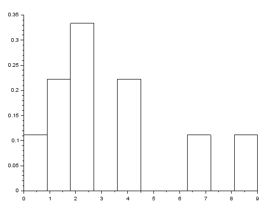

* ``histplot(9, x)``, 9 classes de largeur 1 (au lieu de 10), 0 et 1 sont dans la même 1ère classe [0,1] ::

   x                             // [9, 0, 4, 2, 4, 2, 1, 7, 2, 1]
   histplot(9, x)                // 9 classes de largeur 9 / 9 = 1 [0,1], ]1,2] .. ]8,9]
                                 // [0.3, 0.3, 0, 0.2, 0, 0, 0.1, 0, 0.1]

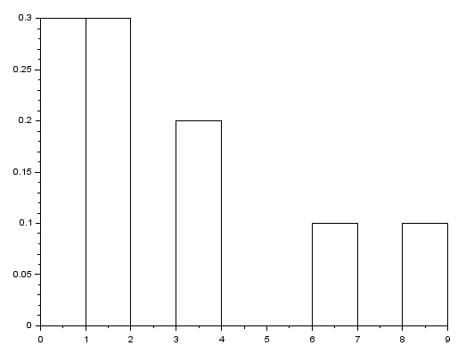

Nuage de points ::

   x = 10 * rand(1, 1000));      // 1000 valeurs de 0 à 10, min(x) = 0.0146197, max(x) = 9,9948808
                                    
   plot(x, ".")                  // nuage de points bleus
   histplot([0:10], x)           // 10 classes de 0 à 10, largeur 1. Les % sont par rapport à 10.
   histplot(10, x)               // 10 classes de largeur ~1, min(x) à max(x). Les % sont plus élevés.

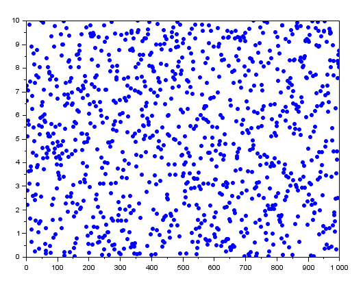
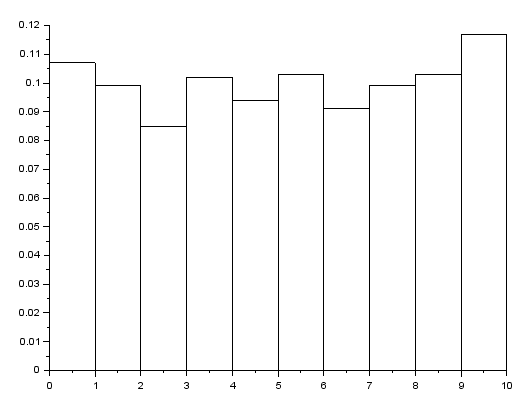
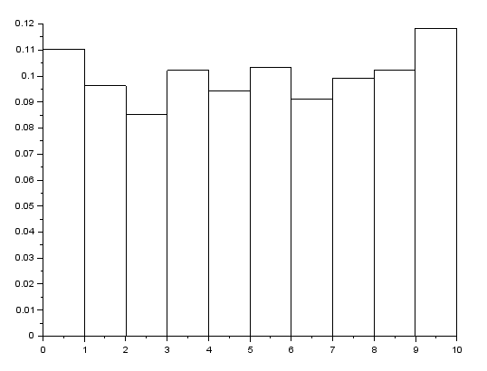

pie
---

Camemberts

::

   pie(X)      // le nombre de parts est length(X)
               // l'aire des parts est proportionnel à l'effectif

Exemple ::

   x = [4, 3, 2, 1]

   pie(x)

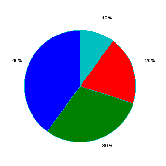

Fonctions de répartition
========================

**binomial** :
   ::
   
      binomial(p, N) // retourne un vecteur de lg N+1
   
   Exemple ::
   
      p = 0.5, N = 2
      binomial(p, N)     // [0.25, 0.5, 0.25]
   
      bar([0:N], binomial(p, N))   // faire commencer les indices commencent à 0
   
**cdfnor** :
   ...
